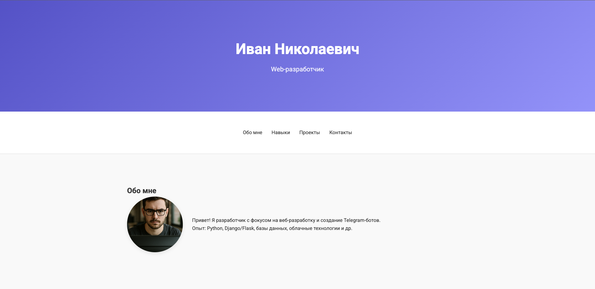
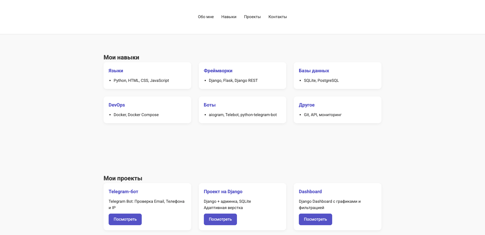
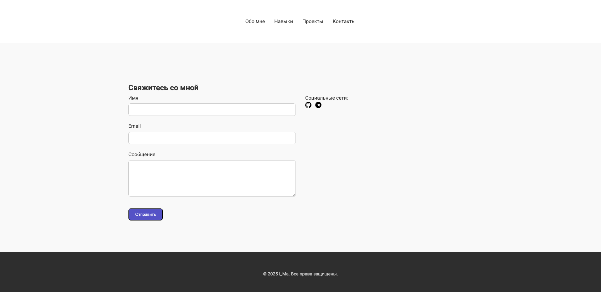

# Иван Николаевич | Личный сайт разработчика

Это персональный сайт-визитка, созданный на Django.  
Содержит информацию обо мне, навыки, проекты, а также форму обратной связи с сохранением сообщений в базу данных и доступом к ним через админку Django.





## Возможности

- Адаптивная верстка
- Разделы "Обо мне", "Навыки", "Проекты"
- Форма обратной связи
- Сохранение сообщений в базу данных
- Просмотр сообщений через Django admin

## Технологии

- Python, Django
- HTML5, CSS3, JavaScript
- PostgreSQL
- Django Admin

## Установка

1. Клонировать репозиторий:

    ```bash
    git clone https://github.com/your-username/your-repo-name.git
    cd your-repo-name
    ```

2. Создать виртуальное окружение и активировать его:

    ```bash
    python -m venv venv
    source venv/bin/activate        # Linux/macOS
    venv\Scripts\activate           # Windows
    ```

3. Установить зависимости:

    ```bash
    pip install -r requirements.txt
    ```

4. Выполнить миграции:

    ```bash
    python manage.py migrate
    ```

5. Создать суперпользователя:

    ```bash
    python manage.py createsuperuser
    ```

6. Запустить сервер:

    ```bash
    python manage.py runserver
    ```

7. Перейти в браузер:

    ```
    http://127.0.0.1:8000/
    ```

## Как протестировать форму

- Перейдите на главную страницу
- Заполните форму в секции "Контакты"
- Отправленное сообщение сохранится в базе
- Зайдите в `/admin`, чтобы увидеть его
